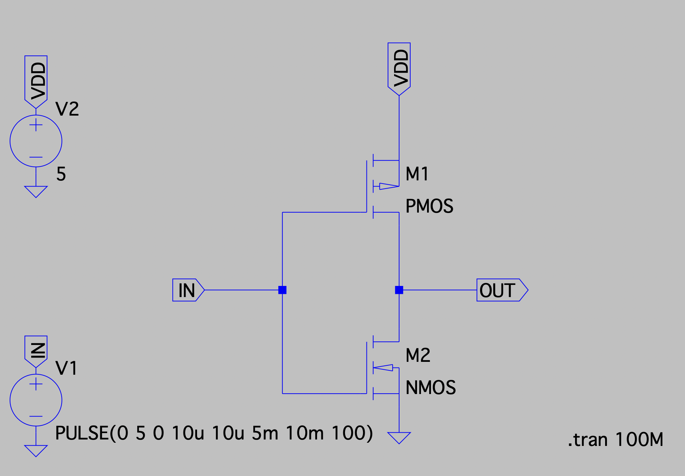
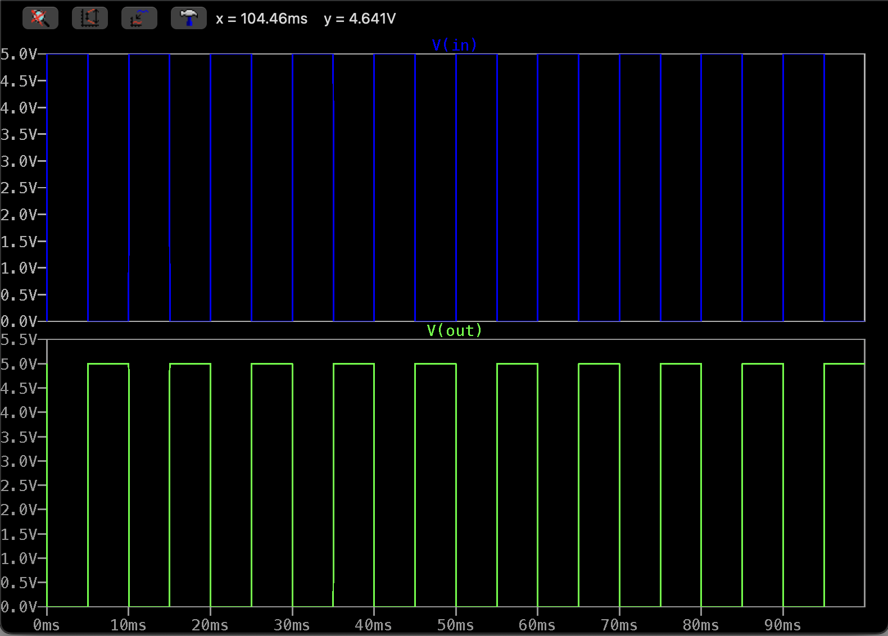
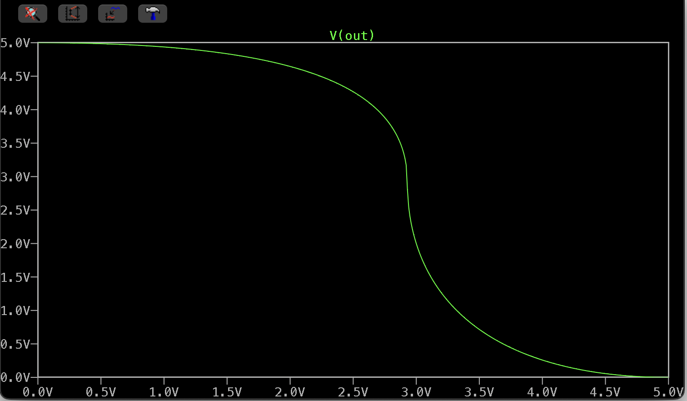

# CMOS-Inverter
To design a CMOS Inverter using LTspice software and studied its Voltage Transfer Characteristics.

## Specifications
- PMOS: W = 720 nm, L = 90 nm. (W/L) ratio = 8
- NMOS: W = 360 nm, L = 90 nm. (W/L) ratio = 4
- Input: Pulse train with Time period = 10 ms, Duty cycle = 50%, Rise time = 10 us, Fall time = 10 us.
- VDD: 5V
{width=250px height=250px}

### Transient Analysis
We can observe that the CMOS inverter turns the 5V signal to OV and vice versa.

### Voltage Transfer Characteristics

